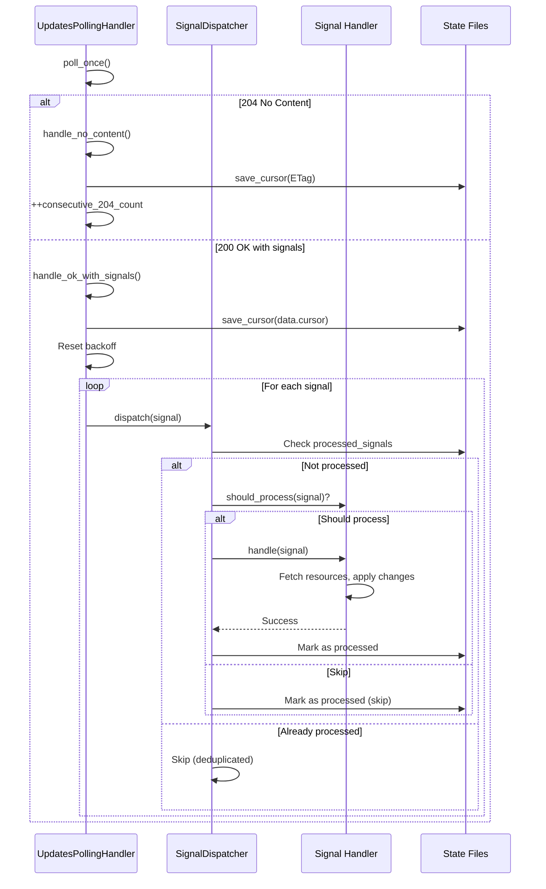

# Signal Handler Architecture - Implementation Summary

## Overview

We have designed and partially implemented a modular signal handler architecture for processing device update signals from the polling endpoint. The architecture follows clean separation of concerns with distinct handler classes for each signal type.

## Architecture Design

### File Structure

```
include/handlers/
├── signal_dispatcher.hpp               # Central dispatcher with deduplication
├── signal_handlers/
│   ├── signal_handler_base.hpp        # Base interface for all handlers
│   ├── install_updated_handler.hpp    # Handle install.updated signals
│   ├── cert_renewed_handler.hpp       # Handle cert.renewed signals
│   └── cert_revoked_handler.hpp       # Handle cert.revoked signals
└── updates_polling_handler.hpp         # Main polling orchestrator

src/
└── handlers/
    └── (corresponding .cpp files when needed)
```

### Core Components

#### 1. Base Handler Interface (`signal_handler_base.hpp`)

```cpp
class ISignalHandler {
public:
    virtual ~ISignalHandler() = default;
    virtual std::string signal_type() const = 0;
    virtual monad::IO<void> handle(const data::DeviceUpdateSignal& signal) = 0;
    virtual bool should_process(const data::DeviceUpdateSignal& signal) const {
        return true;
    }
};
```

**Responsibilities:**
- Defines contract for all signal handlers
- `signal_type()`: Returns signal type string (e.g., "install.updated")
- `handle()`: Processes the signal synchronously
- `should_process()`: Optional filtering (e.g., skip stale versions)

#### 2. Signal Dispatcher (`signal_dispatcher.hpp`)

```cpp
class SignalDispatcher {
private:
    std::unordered_map<std::string, std::shared_ptr<ISignalHandler>> handlers_;
    std::unordered_set<std::string> processed_signals_;  // Deduplication
    std::filesystem::path state_dir_;

public:
    void register_handler(std::shared_ptr<ISignalHandler> handler);
    monad::IO<void> dispatch(const data::DeviceUpdateSignal& signal);
};
```

**Key Features:**
- **Registry Pattern**: Maps signal types to handlers (O(1) lookup)
- **Deduplication**: Tracks processed signals by `type:timestamp_ms`
- **Persistence**: Saves processed signals to `state/processed_signals.json`
- **Retention**: Keeps last 1000 signals or 7 days worth
- **Forward Compatibility**: Unknown signal types logged and ignored
- **Error Recovery**: Handler failures logged but don't block polling

#### 3. Updates Polling Handler (`updates_polling_handler.hpp`)

**Enhanced with:**
- Signal dispatcher integration
- Adaptive backoff tracking (`consecutive_204_count_`, `backoff_level_`)
- Three response handlers:
  - `handle_no_content()`: Process 204 responses, extract ETag cursor
  - `handle_ok_with_signals()`: Process 200 responses, dispatch signals
  - `handle_error_status()`: Handle error responses (401/403/429/5xx)

**Key Implementation:**

```cpp
monad::IO<void> poll_once() {
    return http_io<GetStringTag>(url)
        .then(http_request_io<GetStringTag>(http_client_))
        .then([this](auto ex) {
            int status = ex->response.result_int();
            
            if (status == 204) return handle_no_content(ex);
            else if (status == 200) return handle_ok_with_signals(ex);
            else return handle_error_status(ex, status);
        });
}

monad::IO<void> handle_ok_with_signals(auto ex) {
    return parseJsonDataResponse<DeviceUpdatesResponse>()
        .map([this](DeviceUpdatesResponse resp) {
            cursor_ = resp.data.cursor;
            save_cursor(cursor_);
            
            consecutive_204_count_ = 0;  // Reset backoff
            backoff_level_ = 0;
            
            for (const auto& signal : resp.data.signals) {
                signal_dispatcher_->dispatch(signal).run(ioc_);
            }
        });
}
```

### Handler Implementations

#### Install Updated Handler

**Responsibilities:**
- Fetches full install configuration from API
- Compares versions to avoid re-applying old configs
- Updates local version tracking (`state/install_version.txt`)
- Applies configuration changes

**Version Management:**
```cpp
bool should_process(const DeviceUpdateSignal& signal) const override {
    if (signal.ref.contains("version")) {
        int64_t remote_version = signal.ref.at("version").as_int64();
        return remote_version > local_version_;
    }
    return true;
}
```

#### Certificate Renewed Handler

**Responsibilities:**
- Checks if certificate is in use locally (`state/local_certs.json`)
- Fetches updated certificate material from API
- Installs certificate files with proper permissions
- Reloads affected services (nginx, apache, etc.)

#### Certificate Revoked Handler

**Responsibilities:**
- Removes certificate from active configuration
- Stops services using the certificate
- Moves certificate files to revoked directory for audit
- Updates local certificate tracking

## Data Flow



## Adaptive Backoff Strategy

Based on consecutive 204 responses:

| Consecutive 204s | Backoff Level | Interval |
|-----------------|---------------|----------|
| 0-2 | 0 | 5s (base) |
| 3+ | 1 | 5m |
| 6+ | 2 | 15m |
| 9+ | 3 | 1h |
| 12+ | 4 | 6h |
| 15+ | 5 | 24h (cap) |

Reset to base interval on 200 response with signals.

## State Persistence

### Files Managed

| File | Purpose | Format |
|------|---------|--------|
| `state/last_cursor.txt` | Last polling cursor | Plain text |
| `state/processed_signals.json` | Deduplication | JSON array of signal IDs |
| `state/install_version.txt` | Current install config version | Integer |
| `state/local_certs.json` | Certificates in use | JSON array of cert IDs |
| `state/access_token.txt` | Current access token | Plain text (mode 600) |
| `state/refresh_token.txt` | Refresh token | Plain text (mode 600) |

### Atomic Writes

All state files use atomic write pattern:
```cpp
void save_cursor(const std::string& cursor) {
    auto temp_file = state_dir / ".last_cursor.txt.tmp";
    
    std::ofstream ofs(temp_file);
    ofs << cursor;
    ofs.close();
    
    std::filesystem::rename(temp_file, cursor_file);  // Atomic
    std::filesystem::permissions(cursor_file, 0600);
}
```

## Error Handling

### Handler Level
- All handler errors caught by dispatcher
- Logged with full context
- Polling continues (non-blocking)
- Failed signals NOT marked as processed (may retry on cursor reset)

### Dispatcher Level
```cpp
return handler->handle(signal)
    .then([](){ /* Mark as processed */ })
    .catch_then([](monad::Error e) {
        LOG_ERROR << "Handler failed: " << e.what;
        return IO<void>::pure();  // Continue polling
    });
```

### Polling Level
- Network errors: Exponential backoff
- 401 Unauthorized: Trigger token refresh
- 409 Conflict (cursor expired): Clear cursor, restart
- 429 Rate Limited: Respect retry_after header
- 5xx errors: Exponential backoff up to 5 minutes

## Testing Strategy

### Unit Tests
- Each handler tested in isolation
- Mock signal dispatcher
- Verify version comparison logic
- Test deduplication

### Integration Tests
- Full poll cycle with real server responses
- 204 → 200 transitions
- Signal dispatch and processing
- Cursor management and persistence
- Adaptive backoff behavior

### Test Fixtures
```cpp
TEST(UpdatesPollingHandler, HandlesNoContentResponse) {
    // Mock 204 response with ETag
    // Verify cursor extracted and saved
    // Verify consecutive_204_count incremented
}

TEST(UpdatesPollingHandler, HandlesSignalsResponse) {
    // Mock 200 response with signals
    // Verify each signal dispatched
    // Verify cursor saved
    // Verify backoff reset
}

TEST(SignalDispatcher, DeduplicatesSignals) {
    // Dispatch same signal twice
    // Verify handler called only once
    // Verify both marked as processed
}
```

## Future Enhancements

###1. Async Signal Processing
Current: Synchronous processing blocks polling
Future: Queue signals, process in background worker threads

### 2. Retry Logic for Failed Signals
Current: Failed signals not retried (except on cursor reset)
Future: Exponential backoff retry queue with max attempts

### 3. Priority Queues
Current: FIFO processing
Future: cert.revoked > cert.renewed > install.updated

### 4. Metrics and Monitoring
- Signal processing latency by type
- Handler success/failure rates
- Queue depth over time
- Cursor age

### 5. Configuration Validation
- Verify install configs before applying
- Checksum validation
- Rollback on failure

## Implementation Status

✅ **Completed:**
- Signal handler base interface
- Signal dispatcher with deduplication
- State persistence infrastructure
- 204/200 response handling
- Cursor management
- Adaptive backoff
- Forward compatibility (unknown signals)

⚠️ **Partially Complete:**
- Handler implementations (placeholder logic)
- Actual API resource fetching
- Certificate installation
- Service reloading

❌ **Not Started:**
- Async processing queues
- Retry logic for failed signals
- Priority queues
- Comprehensive metrics
- Configuration validation

## Conclusion

The signal handler architecture provides a solid foundation for processing device updates:

- **Modular**: Each signal type has dedicated handler
- **Extensible**: Easy to add new signal types
- **Resilient**: Deduplication, error recovery, persistence
- **Efficient**: Status-code based branching, adaptive backoff
- **Forward Compatible**: Unknown signals gracefully ignored

The design separates concerns cleanly:
- **Polling**: Updates polling handler
- **Routing**: Signal dispatcher
- **Processing**: Individual signal handlers
- **Persistence**: Atomic state management

This architecture aligns with the CLIENT_AGENT_POLLING.md specification and provides a maintainable foundation for the cert-ctrl agent's update processing functionality.
